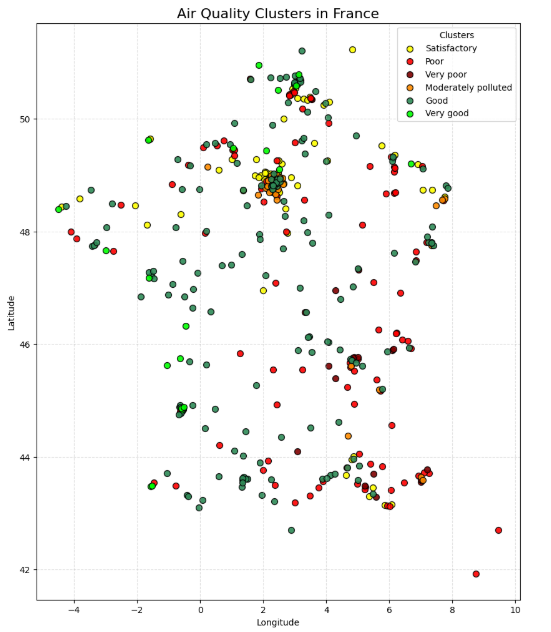
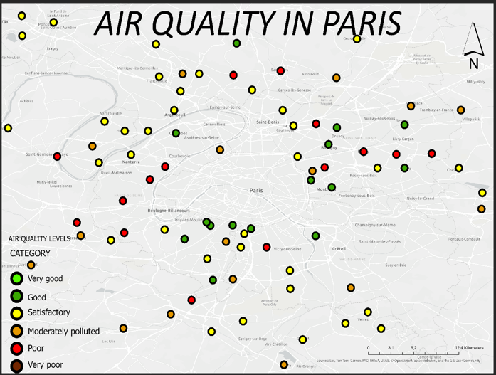
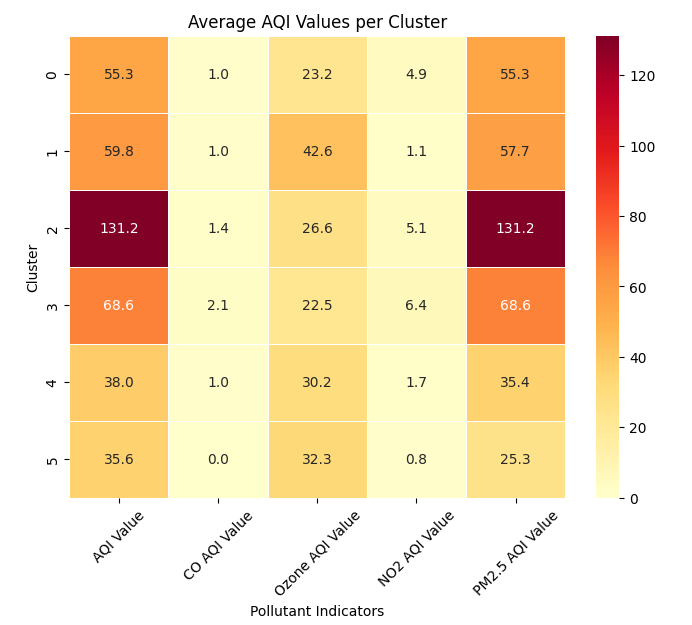
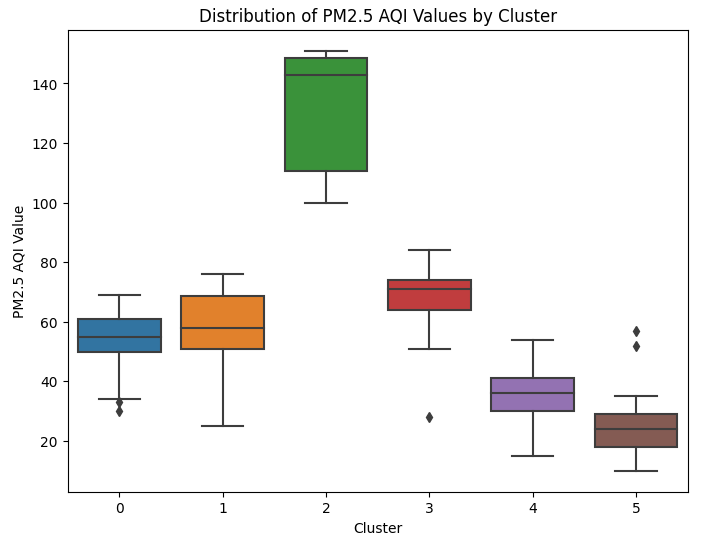
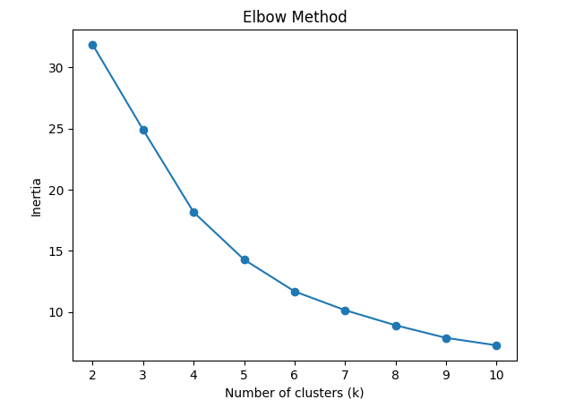
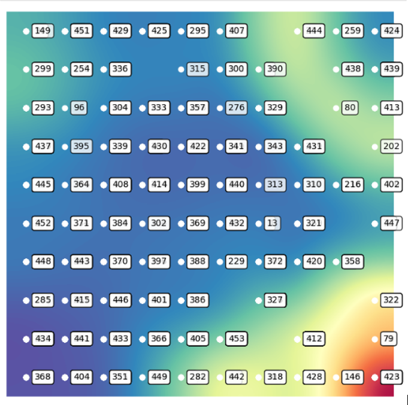

# Air Quality Clustering in France using Self-Organizing Maps (SOM)

This project explores the spatial distribution of air quality across cities in France using an unsupervised machine learning approach. Self-Organizing Maps (SOM) and K-means clustering were used to identify patterns in major air pollution indicators, including PM2.5, CO, NO2, and Ozone.

## Project Overview
The goal of this project is to analyze air quality data from French cities and identify groups of locations with similar pollution profiles. The workflow combines unsupervised machine learning and spatial analysis to reveal both regional and urban patterns.

## Objectives
- Analyze air quality patterns across cities in France
- Apply Self-Organizing Maps (SOM) for unsupervised clustering
- Use K-means clustering to group similar observations
- Visualize cluster patterns through maps and charts
- Explore local variation in the Paris metropolitan area

## Dataset
This project uses the Kaggle dataset *World Air Quality Index by City and Coordinates*.

The original dataset includes air quality observations for cities worldwide. For the purposes of this project, the data was filtered to include only cities in France and the air pollution indicators relevant to the clustering analysis.

Main variables used:
- AQI
- PM2.5 AQI
- CO AQI
- NO2 AQI
- Ozone AQI
- Latitude
- Longitude

This filtered dataset was used to detect air quality patterns across French cities and support spatial clustering and visualization.

**Source:** [World Air Quality Index by City and Coordinates (Kaggle)](https://www.kaggle.com/datasets/adityaramachandran27/world-air-quality-index-by-city-and-coordinates)

## Methodology
The project workflow includes:
1. Data loading and preprocessing
2. Feature selection
3. Min-Max normalization
4. SOM grid definition and training
5. U-Matrix visualization
6. K-means clustering on SOM outputs
7. Elbow method for cluster selection
8. Statistical interpretation of clusters
9. Spatial visualization of results

## Key Findings
- Six air quality clusters were identified
- Southwestern France generally showed better air quality conditions
- Eastern areas more often showed poorer air quality profiles
- The Paris metropolitan area displayed strong local variation in air quality

## Visualizations

### Spatial distribution of air quality clusters across France

### Air quality cluster patterns in the Paris metropolitan area

### Average air quality indicators across clusters

### Distribution of PM2.5 AQI values by cluster

### Elbow method for cluster selection

### U-Matrix visualization

## Repository Structure
- `notebooks/` → Jupyter notebook with the full workflow
- `figures/` → visual outputs, maps, and plots
- `data/` → optional data files or sample data

## Run the Project
1. Clone the repository
2. Install the required Python libraries
3. Open the notebook in Jupyter
4. Run the analysis step by step

## File
- `notebooks/som_air_quality_france.ipynb`

## Notes
This repository is presented as a portfolio project focused on unsupervised learning, spatial analysis, and data visualization.
